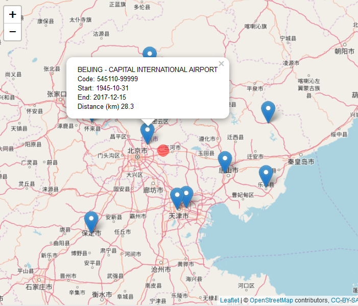

<!-- Edit the README.Rmd only!!! The README.md is generated automatically from README.Rmd. -->

worldmet - R package for accessing NOAA Integrated Surface Database (ISD) meteorological observations
========================================================

For the main **worldmet** website, see <https://davidcarslaw.github.io/worldmet/>.

```{r echo=FALSE}
knitr::opts_chunk$set(
  collapse = TRUE,
  warning = FALSE,
  message = FALSE,
  eval = FALSE
)
knitr::opts_chunk$set(
  fig.path = "man/figures/"
)
```


[](https://github.com/davidcarslaw/worldmet/actions)


`worldmet` provides an easy way to access data from the [NOAA Integrated
Surface Database](https://www.ncdc.noaa.gov/isd) (ISD). The ISD contains detailed surface
meteorological data from around the world for over 35,000
locations. See also the
[map](https://gis.ncdc.noaa.gov/map/viewer/#app=cdo&cfg=cdo&theme=hourly&layers=1).

The package outputs (typically hourly meteorological data) work very
well with the [openair](https://github.com/davidcarslaw/openair) package.

## Installation

Installation of `worldmet` from GitHub is easy using the `devtools`
package.

```{r}
require(devtools)
install_github('davidcarslaw/worldmet')
```

## Brief examples

To search for meteorological sites the user can search by the name or partial name of the site in upper or lower case. The `getMeta` function will return all site names that match the search string. The most important information returned is the `code`, which can then be supplied to the `importNOAA` function that downloads the data.

For example, to search for site "heathrow":

```{r eval=TRUE}
library(worldmet)
## user getMeta function to search for sites
## note code to be used in importNOAA

getMeta(site = "heathrow")
```

Often we have a latitude / longitude of interest. A search can be made based on supplied decimal coordinates and the top `n` nearest sites are returned. The map shows the location searched by the user (red dot) and markers showing the nearest meteorological stations. Click on a station marker to obtain the code and other basic information.

```{r eval=TRUE,echo=TRUE}
## search for near a specified lat/lon - near Beijing airport
## returns 'n' nearest by default
info <- getMeta(lat = 40, lon = 116.9)
info
```



To obtain the data the user must supply a `code` (see above) and year or years of interest. For example, to download data for Heathrow Airport in 2010 (code 037720-99999):

```{r eval=TRUE}
met_london <- importNOAA(code = "037720-99999", year = 2010)
head(met_london)
```

A wind rose (for example) can easily be plotted using `openair`:

```{r windRose, eval=TRUE,echo=TRUE,fig.width=5,fig.height=4.5}
# load openair
library(openair)
windRose(met_london)
```
