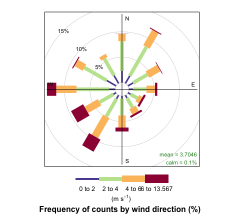

<!-- Edit the README.Rmd only!!! The README.md is generated automatically from README.Rmd. -->

# worldmet - R package for accessing NOAA Integrated Surface Database (ISD) meteorological observations

For the main **worldmet** website, see
<https://davidcarslaw.github.io/worldmet/>.

[](https://github.com/davidcarslaw/worldmet/actions)


`worldmet` provides an easy way to access data from the [NOAA Integrated
Surface Database](https://www.ncdc.noaa.gov/isd) (ISD). The ISD contains
detailed surface meteorological data from around the world for over
35,000 locations. See also the
[map](https://gis.ncdc.noaa.gov/maps/ncei).

The package outputs (typically hourly meteorological data) work very
well with the [openair](https://github.com/davidcarslaw/openair)
package.

## Installation

`worldmet` is available on CRAN and can be installed by typing
`install.packages("worldmet")`.

Installation of the development version of `worldmet` from GitHub is
easy using the `devtools` package.

``` r
require(devtools)
install_github('davidcarslaw/worldmet')
```

## Brief overview

See the Articles tab for more information and interactive map examples.

To search for meteorological sites the user can search by the name or
partial name of the site in upper or lower case. The `getMeta` function
will return all site names that match the search string. The most
important information returned is the `code`, which can then be supplied
to the `importNOAA` function that downloads the data.

For example, to search for site “heathrow”:

``` r
library(worldmet)
## user getMeta function to search for sites
## note code to be used in importNOAA

getMeta(site = "heathrow")
## # A tibble: 1 x 13
##   usaf   wban  station ctry  st    call  latitude longitude `elev(m)` begin     
##   <chr>  <chr> <chr>   <chr> <chr> <chr>    <dbl>     <dbl>     <dbl> <date>    
## 1 037720 99999 HEATHR… UK    <NA>  EGLL      51.5    -0.461      25.3 1948-12-01
## # … with 3 more variables: end <date>, code <chr>, dist <lgl>
```

Often we have a latitude / longitude of interest. A search can be made
based on supplied decimal coordinates and the top `n` nearest sites are
returned. The map shows the location searched by the user (red dot) and
markers showing the nearest meteorological stations. Click on a station
marker to obtain the code and other basic information.

``` r
## search for near a specified lat/lon - near Beijing airport
## returns 'n' nearest by default
info <- getMeta(lat = 40, lon = 116.9)
info
## # A tibble: 10 x 15
##    usaf  wban  station ctry  st    call  latitude longitude `elev(m)` begin     
##    <chr> <chr> <chr>   <chr> <chr> <chr>    <dbl>     <dbl>     <dbl> <date>    
##  1 5451… 99999 BEIJIN… CH    <NA>  ZBAA      40.1      117.      35.4 1945-10-31
##  2 5452… 99999 TIANJIN CH    <NA>  <NA>      39.1      117.       5   1956-08-20
##  3 5452… 99999 BINHAI  CH    <NA>  ZBTJ      39.1      117.       3   1981-11-25
##  4 5453… 99999 TANGSH… CH    <NA>  <NA>      39.6      118.      29   1956-08-20
##  5 5440… 99999 HUAILAI CH    <NA>  <NA>      40.4      116.     538   1956-08-20
##  6 5430… 99999 FENGNI… CH    <NA>  <NA>      41.2      117.     661   1957-06-01
##  7 5442… 99999 CHENGDE CH    <NA>  <NA>      41.0      118.     423   1956-08-20
##  8 5443… 99999 QINGLO… CH    <NA>  <NA>      40.4      119.     228   1957-06-02
##  9 5453… 99999 LETING  CH    <NA>  <NA>      39.4      119.      12   1957-06-01
## 10 5460… 99999 BAODING CH    <NA>  <NA>      38.7      115.      17   1956-08-20
## # … with 5 more variables: end <date>, code <chr>, longr <dbl>, latr <dbl>,
## #   dist <dbl>
```


To obtain the data the user must supply a `code` (see above) and year or
years of interest. For example, to download data for Heathrow Airport in
2010 (code 037720-99999):

``` r
met_london <- importNOAA(code = "037720-99999", year = 2010)
head(met_london)
## # A tibble: 6 x 25
##   code      station   date                latitude longitude  elev    ws      wd
##   <fct>     <fct>     <dttm>                 <dbl>     <dbl> <dbl> <dbl>   <dbl>
## 1 037720-9… HEATHROW… 2010-01-01 00:00:00     51.5    -0.461  25.3  3.27  17.4  
## 2 037720-9… HEATHROW… 2010-01-01 01:00:00     51.5    -0.461  25.3  3.1    6.13 
## 3 037720-9… HEATHROW… 2010-01-01 02:00:00     51.5    -0.461  25.3  3.1   15.6  
## 4 037720-9… HEATHROW… 2010-01-01 03:00:00     51.5    -0.461  25.3  2.93  17.0  
## 5 037720-9… HEATHROW… 2010-01-01 04:00:00     51.5    -0.461  25.3  2.77   0.606
## 6 037720-9… HEATHROW… 2010-01-01 05:00:00     51.5    -0.461  25.3  2.43 356.   
## # … with 17 more variables: air_temp <dbl>, atmos_pres <dbl>, visibility <dbl>,
## #   dew_point <dbl>, RH <dbl>, ceil_hgt <dbl>, cl_1 <dbl>, cl_2 <dbl>,
## #   cl_3 <dbl>, cl <dbl>, cl_1_height <dbl>, cl_2_height <dbl>,
## #   cl_3_height <dbl>, precip_12 <dbl>, precip_6 <dbl>, pwc <chr>, precip <dbl>
```

A wind rose (for example) can easily be plotted using `openair`:

``` r
# load openair
library(openair)
windRose(met_london)
```

<!-- -->
