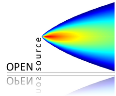
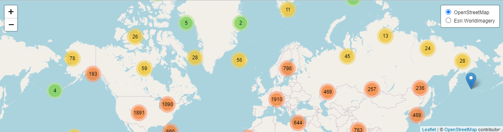

<div align="center">



## **worldmet**
### open source tools to access NOAA Integrated Surface Database (ISD) meteorological observations

<!-- badges: start -->

[](https://github.com/davidcarslaw/worldmet/actions)
[](https://CRAN.R-project.org/package=worldmet)
[](https://cran.r-project.org/package=worldmet)

[](https://github.com/davidcarslaw/worldmet)
[](https://davidcarslaw.github.io/worldmet)
[](https://bookdown.org/david_carslaw/openair/)
<!-- badges: end -->

</div>

**worldmet** provides an easy way to access data from the [NOAA Integrated Surface Database](https://www.ncei.noaa.gov/products/land-based-station/integrated-surface-database) (ISD). The ISD contains detailed surface meteorological data from around the world for over 35,000 locations. See also the [map](https://gis.ncdc.noaa.gov/maps/ncei). The package outputs (typically hourly meteorological data) work very well with the [**openair**](https://github.com/davidcarslaw/openair) package.

<div align="center">

*Part of the openair toolkit*

[](https://davidcarslaw.github.io/openair) | 
[](https://davidcarslaw.github.io/worldmet) | 
[](https://davidcarslaw.github.io/openairmaps) | 
[](https://davidcarslaw.github.io/deweather)

</div>

<hr>

## 💡 Core Features

**worldmet** has a small handful of core functionality.

- **Access ISD metadata** using `getMeta()`.

- **Import ISD monitoring data** using `importNOAA()`, with options to improve performance with parallel processing. Data is in a format ready to use with, for example, `openair::windRose()`.

- **Write files in ADMS format** using `exportADMS()`.

<div align="center">

</div>

<hr>

## 📖 Documentation

All **worldmet** functions are fully documented; access documentation using R in your IDE of choice.

```r
?worldmet::importNOAA
```

Documentation is also hosted online on the **package website**.

[](https://davidcarslaw.github.io/worldmet)

A guide to the openair toolkit can be found in the **online book**, which contains lots of code snippets, demonstrations of functionality, and ideas for the application of **openair**'s various functions.

[](https://bookdown.org/david_carslaw/openair/)

<hr>

## 🗃️ Installation

**worldmet** can be installed from **CRAN** with:

``` r
install.packages("worldmet")
```

You can also install the development version of **worldmet** from GitHub using `{pak}`:

``` r
# install.packages("pak")
pak::pak("davidcarslaw/worldmet")
```

<hr>

🏛️ **worldmet** is primarily maintained by [David Carslaw](https://github.com/davidcarslaw).

📃 **worldmet** is licensed under the [GNU General Public License](https://davidcarslaw.github.io/worldmet/LICENSE.html).

🧑‍💻 Contributions are welcome from the wider community. See the [contributing guide](https://davidcarslaw.github.io/worldmet/CONTRIBUTING.html) and [code of conduct](https://davidcarslaw.github.io/worldmet/CODE_OF_CONDUCT.html) for more information.
